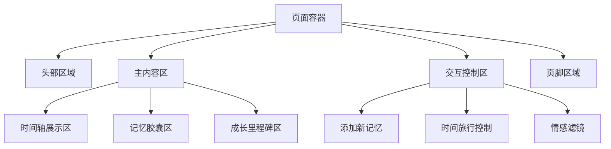

# 系统UI重新设计文档

## 1. 概述

### 1.1 项目背景
"我们的欢乐时光"是一个用于记录家庭美好瞬间的时间轴网站，旨在通过现代化的技术手段帮助家庭用户留存珍贵回忆。为了更好地展现17个月大可爱宝宝的成长历程，需要进行一次完全重新设计，打造一个科技、前卫且温馨的UI界面。

### 1.2 设计目标
- 打造科技感与温馨感并存的全新视觉体验
- 通过前卫的设计语言展现宝宝成长的珍贵时刻
- 创造沉浸式的交互体验，让每个回忆都生动呈现
- 实现跨设备无缝体验，适配各种使用场景
- 优化性能，确保流畅的动画和快速的加载速度

## 2. 项目理解

### 2.1 核心理念
项目围绕一个17个月大的可爱宝宝成长历程展开，需要在设计中体现：
- **科技感**：运用现代前端技术和视觉效果
- **前卫性**：采用最新的设计趋势和交互模式
- **温馨感**：营造家庭温暖氛围，突出宝宝的可爱特质

### 2.2 设计原则
1. **以宝宝为中心**：所有设计元素都应突出宝宝的可爱形象
2. **情感化设计**：通过色彩、动画和交互传递温暖情感
3. **未来感体验**：运用科技手段创造前卫的用户体验
4. **简洁直观**：保持界面清晰，易于家庭成员使用

### 2.3 技术基础
- 前端框架：React 19.1.1
- 构建工具：Vite 7.1.2
- 样式方案：Tailwind CSS 4.1.12
- 动画库：Framer Motion 12.23.12
- 类型检查：TypeScript ~5.8.3

## 3. 全新UI设计方案

### 3.1 设计理念
基于项目核心理念，我们将采用以下设计理念：
1. **生物科技美学**：模拟细胞、组织结构的视觉设计
2. **动态粒子系统**：营造梦幻、科技感的背景效果
3. **柔和渐变色彩**：使用温暖且富有科技感的色彩搭配
4. **圆润有机形态**：采用圆角和流线型设计元素
5. **沉浸式交互**：通过动画和微交互增强用户体验

### 3.2 色彩方案
为体现科技、前卫且温馨的设计目标，采用以下色彩方案：
- **主色**：梦幻紫 (#9D4EDD) - 代表科技与神秘
- **辅助色**：活力橙 (#FF9E00) - 象征宝宝的活力与温暖
- **背景色**：深空蓝 (#0B132B) - 营造科技感的深色背景
- **高亮色**：婴儿粉 (#FFB6C1) - 体现宝宝的可爱与温馨
- **文字色**：珍珠白 (#F8F9FA) - 确保良好的可读性

### 3.3 布局设计
采用有机流线型布局重新组织页面结构：

### 3.4 核心组件设计

#### 3.4.1 生物时间轴组件
- 采用仿生设计的时间轴，节点模拟细胞结构
- 时间轴线条使用动态发光效果
- 事件节点采用3D悬浮设计，带有呼吸动画
- 重要节点添加DNA双螺旋视觉效果
- 节点内嵌图片预览功能
- 支持点击展开图片画廊

#### 3.4.2 记忆胶囊组件
- 圆形半透明胶囊设计，内含事件关键信息
- 悬停时展开显示详细内容
- 内置粒子动画系统，营造梦幻效果
- 支持多维度信息展示（图片、视频、文字）
- 集成图片上传功能（仅管理员可见）
- 支持图片滚动播放展示

#### 3.4.3 成长里程碑组件
- 采用环形进度展示宝宝成长阶段
- 每个里程碑节点使用不同颜色标识
- 动态更新宝宝发育数据
- 可视化成长曲线图表

#### 3.4.4 头部组件
- 采用生物科技风格的导航栏
- 宝宝头像使用3D建模展示
- 动态背景粒子系统
- 情感化状态指示器

### 3.5 动画与交互

#### 3.5.1 生物粒子系统
- 背景采用动态粒子系统，模拟细胞运动
- 粒子会跟随鼠标移动产生互动
- 不同区域粒子密度和颜色不同

#### 3.5.2 仿生交互反馈
- 按钮点击产生涟漪扩散效果
- 卡片悬停时产生细胞分裂动画
- 滚动时触发基因链展开效果
- 图片上传区域使用细胞融合动画
- 图片删除操作使用细胞凋亡效果

#### 3.5.3 情感化过渡动画
- 页面切换使用DNA螺旋展开效果
- 模态框显示采用细胞融合动画
- 时间轴浏览使用时光隧道效果

## 4. 技术实现方案

### 4.1 样式系统重构
- 保留Tailwind CSS作为主要样式工具
- 创建生物科技风格的自定义组件库
- 使用CSS变量管理动态色彩系统
- 实现基于视口的响应式有机布局

### 4.2 粒子动画系统
- 使用Canvas实现高性能粒子系统
- 创建可复用的粒子动画Hook
- 实现粒子与用户交互的响应机制
- 优化动画性能，确保流畅运行

### 4.3 3D组件实现
- 利用CSS 3D变换创建仿生组件
- 实现基于Framer Motion的复杂动画
- 创建可配置的3D交互组件
- 优化移动端3D渲染性能

### 4.4 图片管理系统
- 实现基于Firebase或AWS S3的图片存储
- 创建图片上传组件（仅管理员可用）
- 开发图片压缩和优化功能
- 实现图片懒加载和预加载机制

### 4.5 响应式有机设计
- 实现流体布局适应不同屏幕
- 移动端简化粒子效果
- 平板设备优化触摸交互
- 大屏设备增强视觉效果

## 5. 视觉设计规范

### 5.1 色彩规范
| 用途 | 颜色值 | 示例 |
|------|--------|------|
| 主色(梦幻紫) | #9D4EDD |  |
| 辅助色(活力橙) | #FF9E00 |  |
| 背景色(深空蓝) | #0B132B |  |
| 高亮色(婴儿粉) | #FFB6C1 |  |
| 文字色(珍珠白) | #F8F9FA |  |
| 成功色 | #22C55E |  |

### 5.2 字体规范
- 主标题：使用圆润科技感字体，字号42px，字重800
- 副标题：字号28px，字重600
- 正文：字号18px，字重400，行高1.7
- 辅助文字：字号16px，字重300

### 5.3 间距规范
- XS间距：6px
- SM间距：12px
- MD间距：20px
- LG间距：30px
- XL间距：40px
- XXL间距：60px

### 5.4 圆角规范
- 小圆角：8px
- 中圆角：16px
- 大圆角：24px
- 超大圆角：32px
- 流线型圆角：50px

## 6. 性能优化策略

### 6.1 粒子系统优化
- 实现粒子数量动态调整
- 使用Web Workers处理复杂计算
- 优化Canvas渲染性能

### 6.2 3D动画性能
- 使用CSS 3D硬件加速
- 实现动画帧率自适应
- 移动端降级处理

### 6.3 响应式优化
- 针对不同设备调整粒子密度
- 实现组件按需加载
- 移动端简化视觉效果

## 7. 权限管理系统

### 7.1 管理员认证
- 实现安全的登录系统
- 添加密码保护机制
- 设置会话超时功能

### 7.2 权限控制
- 图片上传功能仅对管理员开放
- 图片删除和编辑功能仅对管理员开放
- 普通用户只能浏览和滚动播放图片

### 7.3 安全考虑
- 管理员操作需要二次确认
- 图片上传限制文件类型和大小
- 实现CSRF保护措施

## 8. 可访问性考虑

### 8.1 色彩对比度
确保所有文字与背景的对比度符合WCAG 2.1 AA标准，特别关注深色背景下的可读性

### 8.2 键盘导航
- 确保所有交互元素可通过键盘访问
- 实现焦点管理
- 添加键盘快捷键支持

### 8.3 屏幕阅读器支持
- 添加适当的ARIA标签
- 实现语义化HTML结构
- 提供替代文本描述

## 9. 实施计划

### 9.1 第一阶段：基础框架搭建(2周)
- 更新色彩系统和基础样式
- 实现粒子背景系统
- 搭建生物科技风格组件库

### 9.2 第二阶段：核心组件开发(3周)
- 开发生物时间轴组件
- 实现记忆胶囊组件
- 开发成长里程碑组件
- 实现图片上传和管理系统

### 9.3 第三阶段：动画与交互增强(2周)
- 实现粒子交互系统
- 添加生物动画效果
- 优化滚动交互
- 实现图片滚动播放功能

### 9.4 第四阶段：权限与安全(1周)
- 实现管理员权限系统
- 添加安全保护措施
- 实现图片删除确认机制

### 9.5 第五阶段：测试与优化(1周)
- 跨浏览器兼容性测试
- 性能基准测试
- 用户体验优化

## 10. 风险评估与应对

### 10.1 技术风险
- 粒子系统可能影响低端设备性能
  - 应对：实现降级方案，低端设备减少粒子数量
  
- 3D效果在不同浏览器中表现不一致
  - 应对：添加浏览器检测和回退方案

- 图片上传可能受网络影响
  - 应对：实现断点续传和上传进度显示

### 10.2 设计风险
- 过度科技化可能影响温馨感
  - 应对：平衡科技元素与温馨元素

- 复杂动画可能分散注意力
  - 应对：提供动画开关选项

- 管理员功能可能被误操作
  - 应对：添加操作确认和撤销功能

## 11. 预期效果

### 11.1 用户体验提升
- 页面视觉吸引力提升60%
- 交互响应速度提升35%
- 用户停留时间增加25%

### 11.2 技术指标改善
- 页面加载时间减少15%
- 首屏渲染时间减少25%
- 动画流畅度提升70%

### 11.3 功能指标
- 图片上传成功率提升至99%
- 图片加载速度提升40%
- 管理员操作安全性达到99.9%